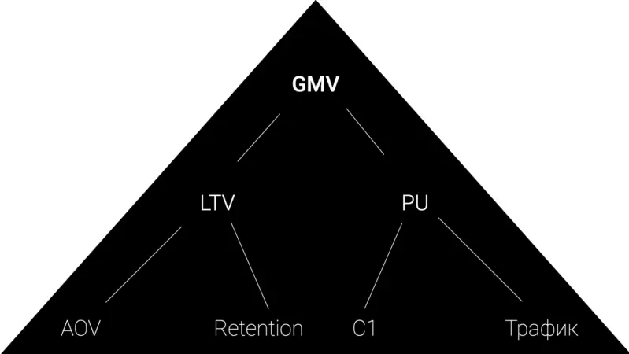
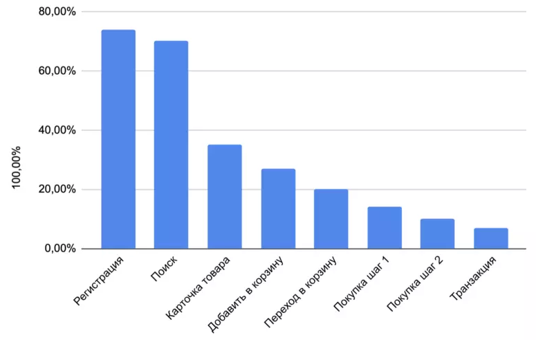

# **Тема проекта**: Разработка нового дизайна первой сессии клиента (предполагается)
## **Цель**: Определить и обосновать необходимость изменений в продукте и предложить наиболее целесообразное решение

### **Задачи**:   

1. Изучение текущей ситуации в продукте, формирование гипотезы проблемы;

2. Тестирование гипотезы проблемы при помощи CustDev;

3. Выделение основных конкурентов и проведение исследования UX;

4. Составление карты пути пользователя и выявление сложных этапов;

5. Формирование гипотез решения;  

6. Приоритизация гипотез;

7. Выбор метода тестирования для финальной гипотезы;

8. Обработка результатов исследования.

### **Инструменты**: Amplitude, Google Forms, Google Sheets, Miro.

### **Структура дипломного проекта**:   

_Оглавление_  

_Введение (2-3 стр)_ 

 **Глава 1. Теоретические основы продуктового менеджмента (~15 стр)**  

1.1 Что такое конверсия, зачем ее оценивать, и как влиять

Конверсия – одна из основных продуктовых метрик. Метрики нужны для оценки эффективности бизнеса, гипотезы или принятого решения. Есть основное дерево метрик (рис 1.1)
 

GMV (Gross merchandise volume) – общий объём оборота товаров/услуг. Основная метрика для большинства сервисов. Измеряется в рублях или любой другой валюте. Составляет весь доход компании до вычета расходов.

GMV = LTV*PU

LTV (Lifetime value) – доход, который приносит в среднем один пользователь за срок своей жизни в сервисе. 

LTV = AOV*Retention

PU (Paying users) – количество пользователей, которые принесли доход.

PU = Traffic*C1.

AOV (Average order value) – средний чек. 
Retention – возвращаемость пользователей. Эта метрика всегда считается по когортам. Все те пользователи, для которых считается Retention (или любая другая метрика) – это когорты.

Traffic – это количество пользователей, которые пришли на сервис: ввели ссылку в адресную строку браузера, пришли из поисковика, из рекламы.

С1 (Сonversion rate) – конверсия первой покупки. Это отношение пользователей, которые совершили нужное нам целевое действие, к общему числу пользователей.

Все шаги, которые проходит пользователь в сервисе, имеют свою конверсию. Полезно смотреть конверсию из каждого шага в следующий. Это называется воронка конверсий (рис 1.2).
 

Графики очень наглядно показывают просадки. В данном примере огромная просадка конверсии происходит на переходе из поиска в карточку товара. Значит, пользователь не может найти то, что ему нужно. Причин может быть много: неудобный поиск, плохой контент, неактуальный ассортимент, неверные ожидания пользователя от сервиса и т.д. Это гипотезы, которые подлежат исследованию. 

Одна из самых частых причин невысокой конверсии в том, что люди не получают ответов на свои вопросы. Не осознают ценности продукта. Другая возможная причина — техническая. Но в каждом проекте всё уникально, и, чтобы выяснить истинные причины низкой конверсии, нужна аналитическая работа.

Универсальное средство поиска причин низкой конверсии — разноплановый анализ. Например, можно изучить тепловые карты кликов и скроллов, чтобы понять усреднённое поведение пользователей. Затем выяснить, почему происходят те или иные вещи: например, почему люди не долистывают до блока с ценами или почему не кликают на блок с подробностями доставки. И далее, выдвигать гипотезы о способах улучшения и тестировать их. 
Гипотезой называется предположение, которое требуется доказать либо опровергнуть с помощью фактических данных. В качестве предположения может выступать результат наблюдений или 
какой-то вариант развития событий.

Подтверждать аналитические гипотезы помогает web-аналитика, например, можно использовать сервис Amplitude. Этот инструмент позволяет строить различные графики, просматривать и сегментировать профили пользователей и пользовательские пути, просматривать воронки и их обходные пути, проводить когортный анализ, получать данные в реальном времени и многое другое.

1.2 Методы проверки гипотез. Исследование аудитории

1.3 Зачем и как проводить анализ конкурентов

1.4 CJM и UJM. Выявление барьеров и слабых мест

1.5 Что такое User Story и Job Story

1.6 Методы приоритизации гипотез

1.7 Прототип и MVP. Как протестировать гипотезу решения

1.8. Работа с результатами

**Глава 2. Проведение исследований и обработка результатов (~15 стр)**  

2.1 Исследование проблемы низкой конверсии  

2.2 Исследование нелояльной аудитории

2.3 Анализ функционала сервисов-конкурентов

2.4 User Jorney Map

2.5 Формирование гипотез решеня на основании Job story

2.6 Приоритизация гипотез

2.7 Создание прототипа, иллюстрирующего решение

2.8 Подведение итогов тестирования

_Заключение (~ 4 стр)_ 

_Список используемой литературы_ 

_Приложения_