# **Тема проекта**: Исследование конверсии в b2b-сервисе E-mail маркетинга и разработка гипотезы по улучшению показателей. Разработка дизайна первой сессии клиента.
## **Цель**: Определить и обосновать необходимость изменений в продукте и предложить наиболее целесообразное решение

### **Задачи**:   

1. Изучение текущей ситуации в продукте, формирование гипотезы проблемы;

2. Тестирование гипотезы проблемы при помощи CustDev;

3. Выделение основных конкурентов и проведение исследования UX;

4. Составление карты пути пользователя и выявление сложных этапов;

5. Формирование гипотез решения;  

6. Приоритизация гипотез;

7. Выбор метода тестирования для финальной гипотезы;

8. Обработка результатов исследования.

### **Инструменты**: Amplitude, Google Forms, Google Sheets, Miro.

### **Структура дипломного проекта**:   

_Оглавление_  

_Введение_ 

В качестве объекта исследования выбран b2b-сервис e-mail рассылок. 

Одно из ключевых отличий b2b-рынка состоит в методах поиска клиентов (или потенциальных лидов), методах продаж и работы с ними. В частности, b2b модели состоят в следующем.

Длительный цикл продаж. В среднем продажа решения b2b-клиенту занимает минимум 3 месяца. В некоторых продуктах и индустриях этот цикл может растягиваться до 6 месяцев и целого года, причем это может даже зависеть от того, в какое время года начинается общение с клиентом. 

Зачастую в таких сделках очень много согласований и расчетной рациональности клиентов. Но все это компенсируется повышенной стоимостью сделки, и зачастую долгосрочным сотрудничеством, так как процесс расторжения отношений также длительный и сложный. При этом покупателей на рынке намного меньше, чем в b2c сегментах.

Выбранный сервис e-mail рассылок существует на рынке длительное время и завоевал свой сегмент аудитории среди крупных клиентов, основными требованиями которых были безопасность и скорость. 

Но в нынешних реалиях, в связи с уходом с рынка РФ иностранных сервисов-конкурентов, многие компании SMB испытали потребность в поиске аналогичного сервиса, который мог бы решить их проблему взаимодействия с клиентами.

В данном случае лучше сосредоточиться на привлечении новых пользователей и их удержании, доведении до покупки платной подписки на сервис.

В продукте имеется пробный тариф с ограниченным лимитом на загрузку данных и тираж писем для тестирования функциональных возможностей, не ограниченный по времени. 

В b2b сегменте риски клиента повышены, так как компании-клиенты имеют свою аудиторию, свои бизнес-процессы и поэтому будут предъявлять повышенные требования к нашему продукту. Для того, чтобы удовлетворить эти запросы, мы начинаем процесс discovery, чтобы как следует изучить рынок и потребителя и не потратить деньги на ненужную разработку.

Цель этого исследования: определить и обосновать необходимость изменений в продукте и предложить наиболее целесообразное решение. 

Задачи, которые необходимо решить для достижения цели проекта:

1.	Изучение текущей ситуации в продукте, формирование гипотезы проблемы.

2.	Тестирование гипотезы проблемы при помощи CustDev.

3.	Выделение основных конкурентов и проведение исследования UX.

4.	Составление карты пути клиента и пользователя и выявление сложных этапов.

5.	Формирование гипотез решения.

6.	Приоритизация гипотез решения.

7.	Визуализация финальной гипотезы.

8.	Выбор метода тестирования для гипотезы.

9.	Обработка результатов исследования.

В результате работы предполагается получить решение по улучшению одной из метрик продукта. 

Инструменты, с которыми придется познакомиться и поработать для достижения цели проекта: Amplitude, Google Forms, Google Sheets, Miro, Figma.

Проект разработан самостоятельно в роли продакт-менеджера.

 **Глава 1. Теоретические основы продуктового менеджмента**  

**1.1 Что такое конверсия, зачем ее оценивать, и как влиять**

Конверсия – одна из основных продуктовых метрик. Метрики нужны для оценки эффективности бизнеса, гипотезы или принятого решения. Есть основное дерево метрик (рис 1.1)
 

рис 1.1.

GMV (Gross merchandise volume) – общий объём оборота товаров/услуг. Основная метрика для большинства сервисов. Измеряется в рублях или любой другой валюте. Составляет весь доход компании до вычета расходов.

GMV = LTV*PU

LTV (Lifetime value) – доход, который приносит в среднем один пользователь за срок своей жизни в сервисе. 

LTV = AOV*Retention

PU (Paying users) – количество пользователей, которые принесли доход.

PU = Traffic*C1.

AOV (Average order value) – средний чек. 
Retention – возвращаемость пользователей. Эта метрика всегда считается по когортам. Все те пользователи, для которых считается Retention (или любая другая метрика) – это когорты.

Traffic – это количество пользователей, которые пришли на сервис: ввели ссылку в адресную строку браузера, пришли из поисковика, из рекламы.

С1 (Сonversion rate) – конверсия первой покупки. Это отношение пользователей, которые совершили нужное нам целевое действие, к общему числу пользователей.

Все шаги, которые проходит пользователь в сервисе, имеют свою конверсию. Полезно смотреть конверсию из каждого шага в следующий. Это называется воронка конверсий (рис 1.2).
 

рис 1.2.

Графики очень наглядно показывают просадки. В данном примере огромная просадка конверсии происходит на переходе из поиска в карточку товара. Значит, пользователь не может найти то, что ему нужно. Причин может быть много: неудобный поиск, плохой контент, неактуальный ассортимент, неверные ожидания пользователя от сервиса и т.д. Это гипотезы, которые подлежат исследованию. 

Одна из самых частых причин невысокой конверсии в том, что люди не получают ответов на свои вопросы. Не осознают ценности продукта. Другая возможная причина — техническая. Но в каждом проекте всё уникально, и, чтобы выяснить истинные причины низкой конверсии, нужна аналитическая работа.

Универсальное средство поиска причин низкой конверсии — разноплановый анализ. Например, можно изучить тепловые карты кликов и скроллов, чтобы понять усреднённое поведение пользователей. Затем выяснить, почему происходят те или иные вещи: например, почему люди не долистывают до блока с ценами или почему не кликают на блок с подробностями доставки. И далее, выдвигать гипотезы о способах улучшения и тестировать их. 
Гипотезой называется предположение, которое требуется доказать либо опровергнуть с помощью фактических данных. В качестве предположения может выступать результат наблюдений или 
какой-то вариант развития событий.

Подтверждать аналитические гипотезы помогает web-аналитика, например, можно использовать сервис Amplitude. Этот инструмент позволяет строить различные графики, просматривать и сегментировать профили пользователей и пользовательские пути, просматривать воронки и их обходные пути, проводить когортный анализ, получать данные в реальном времени и многое другое.

**1.2 Методы проверки гипотез. Исследование аудитории**

Проверка гипотез – неотъемлемая часть работы по оптимизации любой стратегии. Применяя различные методы тестирования идей, можно просто и успешно выполнять множество задач: повышать показатели конверсий, увеличивать трафик, стимулировать рост прибыли и многое другое.

Благодаря проверке гипотезы можно выяснить, в какой вид необходимо ее привести, чтобы получить нужный результат. При этом требуется минимум затрат времени и денег, что позволяет экономить наиболее ценные ресурсы компании.

Тестирование гипотез в бизнесе может осуществляться разными способами:

Проверка переходом.

Метод предполагает создание посадочной страницы с целью моделирования ситуации, будто продукт уже есть в наличии. При этом необходимо понимание того, кому и что вы собираетесь продавать.

В качестве каналов привлечения ЦА может использоваться реклама в соцсетях, контент маркетинг, объявление на "Авито" и др. досках.

Привлеченных клиентов нужно активировать, чтобы узнать, действительно ли их уровень заинтересованности достаточный, чтобы совершить конверсионное действие. Это можно сделать, собирая контактные данные через форму обратной связи.

Для существующих продуктов актуально тестирование спроса на новую функцию, путем установки пустой кнопки (fake button).

Проверка покупкой.

В этом случае нужно не просто проверить, готов ли клиент выбрать товар и оставить заявку, но и подвести его непосредственно к покупке. Если продукт отсутствует, однако вы хотите проверить гипотезу, можно предложить потенциальному клиенту сделать предзаказ. Если клиенту не нужно тщательно тестировать продукт перед покупкой, можно проверять интерес к нему с помощью MVP.

Проверка использованием.

Можно проверить, как продукт или бизнес будет работать на деле. Это наиболее ресурсозатратно, но в результате можно получить опыт прохождения всех этапов развития продукта и обратную связь по различным вопросам, которые могут возникнуть в бизнесе, и его узкие места.

Для существующих продуктов, чтобы проверить изменение, используют A/B-тестирование – количественный метод исследования. Он основан на фиксации реального поведения пользователей. A/B-тестирование применяется, когда стоит задача сравнить два варианта, отличающиеся друг от друга одним измененным элементом, и определить, какой из них положительно влияет на KPI или на конверсию.

Проверка мнением целевой аудитории.

Чтобы собрать данные о целевой аудитории и ее проблемах, гипотезы можно проверять с помощью анализа мнений клиентов. 

Основная задача – подтолкнуть людей к тому, чтобы они высказались по теме, решили принять участие в обсуждении и рассказать о своих желаниях, предпочтениях, претензиях.

Понимание пользователя и его переживаемый опыт крайне важны в B2B. Конечный потребитель может и не иметь вообще никакого влияния на смену продукта. Оператору может не нравиться выбранная CRM-система в компании, но его начальству проблемы не будут понятны, так как заказчик не работает в продукте ежедневно. Поэтому критично важно погружаться в опыт пользователей.

Традиционно методы пользовательских исследований делятся на качественные и количественные. Качественные направлены на получение максимально полных и детализированных сведений об объекте изучения – человеке, пользователе; количественные дают понимание о количестве и распространенности явлений в большой группе – популяции, аудитории.

Глубинное интервью – качественный метод исследования, который применяется на всех этапах работы над продуктом. Выделяют проблемные и решенческие интервью. В ходе проблемного интервью проверяют гипотезы о проблеме, а в ходе решенческого – гипотезы о концепции решения. 

Групповое фокусированное интервью — качественный метод исследования, который предполагает обсуждение определенной темы сразу с несколькими респондентами. У фокус-группы та же цель, что и у интервью — получить глубинную информацию о целевой аудитории, узнать ее задачи и проблемы, ожидания и предпочтения, мотивы поведения пользователей. 

Peer-группы – качественный метод с использованием групп по 2−4 респондента. Часто применяется в исследованиях детской аудитории или для изучения устойчивых малых групп: семей, партнеров по бизнесу.

Этнографическое исследование (наблюдение за поведением людей в естественной среде обитания) – качественный метод, который помогает в разработке продуктов и построении пользовательского опыта. Наблюдатель подмечает и описывает контекст, в котором находится потенциальный пользователь: кто и что его окружает, какие задачи, в какой последовательности и в какой момент человек решает, с чего он начинает, на что или на кого отвлекается в процессе и т.п. 

Юзабилити-тестирование. Этот метод также основан на наблюдении за взаимодействием пользователя и продукта, но в отличие от этнографических исследований, где мы пытаемся увидеть спонтанное поведение людей, в тестированиях моделируются определенные ситуации взаимодействия. 

Ключевое отличие тестирований от интервью в том, что здесь мы не опираемся на мнения и оценки, которые могут искажаться под воздействием разных причин, а наблюдаем за более объективной сущностью — действиями в интерфейсе при решении задач. К методу юзабилити-тестирования можно обращаться, когда проблема, которую решает продукт, уже валидирована и появляются первые визуальные прототипы решения.

Опрос – количественный метод, применяется на всех стадиях работы над продуктом. Опрос дает возможность оценивать объекты и явления количественно: понять состав аудитории продукта, оценить частоту встречаемости определенного признака, приоритизировать идеи и проблемы, выбрать лучший вариант и т.п.

При выборе метода исследования необходимо учесть специфику бизнеса, этап жизни продукта и здравый смысл. Определить цель исследования, применимость результатов, риски исследования или его отсутствия и ресурсы команды.

Для ранних этапов развития продукта больше подходят качественные исследования, а для более зрелых – количественные. Нужно понимать, что в качественных исследованиях гипотезы генерируются, а в количественных – валидируются. 

В продуктовых исследованиях часто используют сочетание качественного и количественного подходов, причем, не только как последовательность методов, но и объединяя описательные и статистические методы анализа в одном исследовании.  

**1.3 Зачем и как проводить анализ конкурентов**

Перед тем, как выбрать направление для развития продукта, очень полезно оглянуться вокруг и посмотреть на конкурентов.

Это дает возможность получить ценную информацию по особенностям, важнейшим функциям и пользовательским сценариям. Плохие примеры у конкурентов тоже очень полезны. Анализируя их, можно понять, как делать не надо.

Сложно найти уникальный сервис, который бы не имел аналогов на рынке. Все компании, приложения, сайты так или иначе похожи между собой — они решают «боли» и проблемы своих юзеров. У кого-то получается сделать это быстрее и лучше других, и поэтому они выходят в топ-компаний в своём пользовательском сегменте.

Чтобы определить направление для развития, нужно понять, с какими задачами пользователи обращаются к сервису и какие альтернативы у них есть.

О том, зачем люди приходят на сервис, косвенно говорят поисковые запросы. То есть для части аудитории первой альтернативой будет другой сервис в поисковой выдаче. Во время просмотра могут обнаружиться новые слова, термины, выражения, которые используются в контексте той же самой задачи. Также на этом этапе могут появиться неожиданные результаты, которые касаются функциональных возможностей конкурентов. У пользователя могут быть и другие способы решить свою задачу. Они тоже войдут в список (рис 1.3).

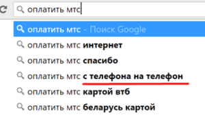  
рис 1.3.

Чтобы увидеть основные преимущества и недостатки сервисов и существующие модели поведения пользователей, не нужно анализировать их все. Нужно определить несколько сегментов конкурентов:

Проекты схожей тематики и схожей функциональности — прямые конкуренты. Они нацелены на ту же аудиторию и решают те же задачи в таком же контексте. Их стоит анализировать.

Проекты другой тематики, но другой функциональности (в том числе не цифровой) – альтернативы. Немного отличается аудиторией или контекстом, но решает те же задачи с точки зрения пользователя. Их можно не анализировать подробно, а скорее для поиска отдельных интересных решений.

Проекты другой тематики, но схожей функциональности — косвенные. 

Например: мы создаем сайт для авиакомпании. В данном случае прямыми конкурентами будут все аналогичные сайты авиакомпаний, работающие с нашей целевой аудиторией. Альтернативами в данном случае будут сервисы, помогающие добраться из пункта А в пункт Б: сайты железной дороги, междугородних автобусов. Другая тематика, но схожая функциональность — сервисы для аренды автомобиля, каршеринга или поиска попутчиков.

Самая важная группа – прямые конкуренты. Из них следует выделить основных, для каждого из которых полезно составить профиль, с кратким описанием аудитории, ценности сервиса с точки зрения пользователя и субъективного восприятия его пользователями.

Далее нужно выбрать параметры для сравнения продукта с продуктами конкурентов.

Параметр — это всё, что может иметь для пользователя ценность в контексте конкретной задачи. Параметры могут описывать как доступные функции, так и их конкретную реализацию. 

Когда определены параметры сравнения и список конкурентов, можно исследовать их продукты: зайти на сайт или в приложение и повторить путь пользователя. Возможно, придется зарегистрироваться, чтобы получить бесплатный пробный период и оценить нужные функции. По ходу дела может быть полезно делать скриншоты и записывать замечания о плюсах, минусах и интересных решениях.

Конкурентный анализ помогает увидеть ситуацию на рынке, лучше понять сильные и слабые стороны конкурентов, получить дополнительные аргументы в пользу той или иной стратегии развития.

**1.4 CJM и UJM. Для чего составлять карту пути пользователя**

Customer journey map, или СJM — это описание пути клиента с момента, когда он о вас еще не знает, до совершения покупки и дальше.

CJM помогает увидеть незакрытые потребности клиента, его проблемы при взаимодействии с компанией и усовершенствовать пользовательский опыт, используя эти знания.

Важная деталь: CJM — это именно про путь клиента. Бывает так, что продукт покупает один человек, а пользуется им другой. Поэтому в терминологии построения карт клиент — тот, кто ищет, выбирает и покупает. User — кто пользуется продуктом/услугой. Это может быть и один человек, а могут быть два разных.

Техника построения journey map одна — это граф, на который наносятся этапы взаимодействия с пользователем, точки контакта на каждом этапе, действия пользователя и его эмоции. Ключевое отличие карт основывается на том, для кого они строятся. 

Customer journey map — это карта пути клиента, который взаимодействует с компанией и принимает решение купить продукт или услугу.

User journey map — это карта пути пользователя внутри продукта.

По определению, карта пути пользователя — это визуализация отношений человека с продуктом во времени. Она включает в себя серию действий, объединенных в временную шкалу, которая затем наполняется мыслями и эмоциями пользователя для создания повествования. Затем это повествование сжимается для создания визуализации (рис 1.4).

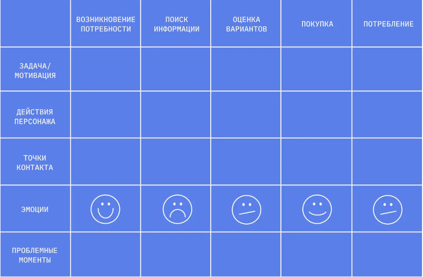  
рис 1.4.

С помощью UJM вы можете определить проблемы, с которыми сталкиваются ваши пользователи на разных этапах взаимодействия. Это может быть трудности в поиске необходимой информации, недоступность функционала на определенных типах устройств, непонятность процесса заказа. Также вы можете узнать, как пользователи смотрят на ваш бренд и определить, что им не нравится.

Шаги для создания User Journey Map:

1. Определение цели UJM.
Прежде чем начать собирать данные для UJM, необходимо определить, какова будет ее цель. Нужно задуматься, какие аспекты пользовательского опыта хочется изучить, чего достичь и какие выводы сделать после анализа пользовательского опыта.

2. Определение пользовательских сценариев.
Пользовательские сценарии – это описания множества возможных действий, которые пользователь может выполнить в продукте. Нужно определить основные сценарии пользователя и те, которые следует подробнее изучить. Это поможет понять, какие шаги пользователя нужно проанализировать и на каком этапе определить моменты, когда пользователь может столкнуться с трудностями.

3. Сбор данных.
Чтобы создать UJM, необходимо собрать данные о поведении пользователей в продукте. Это можно сделать, проведя пользовательское исследование, интервьюируя пользователей, анализируя данные с помощью специальных инструментов для отслеживания пользовательских треков.

4. Составление карты пути пользователя.
После сбора достаточного количества данных, необходимо составить карту пути пользователя. Отметить ключевые моменты взаимодействия пользователя с продуктом, разбив их на отдельные этапы, начиная с первого контакта и заканчивая целевым действием пользователя.

5. Анализ карты пути пользователя.
Когда карта пути пользователя готова, необходимо провести анализ. Взглянуть на каждый этап и выяснить, где пользователь может испытывать затруднения, а где, наоборот, находится наибольшая удобство и удовлетворенность. Это поможет улучшить пользовательский опыт.

Первый шаг использования User Journey Map – определение всех ключевых этапов, которые проходит пользователь на пути к достижению своих целей. Это может быть поиск информации, выбор товаров или услуг, регистрация, оплата и др.

Важно не только учитывать шаги, но и эмоциональный опыт пользователя на каждом этапе. Оценить, какой уровень удовлетворения или разочарования испытывает пользователь на каждом этапе и почему. Это поможет идентифицировать те моменты, которые необходимо улучшить, чтобы повысить уровень удовлетворенности клиентов.

Следующий шаг – идентифицировать проблемные зоны и возможности для улучшения. Определить те моменты, которые вызывают больше всего недовольства у клиентов.
На основании данных от UJM следует составить план мероприятий для улучшения пользовательского опыта на каждом из этапов. 

Важно помнить, что пользовательский опыт – это непрерывный процесс, требующий постоянного мониторинга и улучшения. UJM помогает понять, как можно улучшить взаимодействие с клиентами, и делать более точные выводы о том, как управлять процессом оптимизации.

**1.5 Что такое User Story и Job Story**

Story Mapping — в переводе с английского «карта историй». Она помогает урегулировать рабочие процессы в команде и показывает последовательность действий, которые необходимо реализовать в будущем продукте. Это главный источник информации для разработчиков, благодаря которому одна большая задача разбивается на конкретные подзадачи для достижения общей цели.

Стандартные подходы к написанию историй — User Story и Job Story. Их часто сравнивают между собой и спорят, какая техника эффективнее на сегодняшний день.

User Story или история пользователя — это инструмент, который показывает, как происходит взаимодействие пользователя с продуктом: какие блоки наиболее важны для него, а какие можно убрать, где ему все понятно, а что вызывает вопросы и требует разъяснений.

Чаще всего этот инструмент применяется на старте работы и помогает понять, каким должен быть конечный результат, где необходимо внести корректировки и какие задачи необходимо выполнить в первую очередь.

    Формула User Story:

    **Я как Х, хочу Y, чтобы Z**

    X – это основной пользователь нашего продукта, персонаж, который рассказывает историю. Под него мы подстраиваем весь функционал.

    Y – основное желание персонажа.

    Z – конечный результат, выгода, которую стремится получить пользователь.

Концепция Jobs To Be Done (JTBD) смещает фокус с характеристик пользователя на ситуацию, в которой у него возникает потребность воспользоваться продуктом. Главным становится то, какую ценность продукт может иметь для потребителя.

В концепции JTBD используется фреймворк Job Stories. 

В Job Story собирают подробные данные о потребности человека: ситуация, в которой возникла проблема, мотивация, или изменение — что должно произойти, чтобы проблема исчезла, и результат — что будет, когда проблема решится.

    Формула Job Story:

    **Когда Х, я хочу Y, чтобы Z**

    X – ситуация, в которой находится пользователь.

    Y – основное желание.

    Z – конечный результат.

Job Story помогает определить:

-	какие существуют ситуации, где человека что-то беспокоит, тревожит, доставляет дискомфорт;

-	есть ли паттерны поведения или привычки, мешающие использовать продукт;

-	чего ждут пользователи, какие положительные изменения могут подтолкнуть их к покупке;

-	какие чувства испытывает человек, мешают ли ему тревоги, страхи или опасения стать клиентом.

Усиливая драйверы и устраняя барьеры, можно не только побудить потенциального клиента к покупке, но и превратить его в адвоката бренда в будущем.

Job Stories не дают готового решения, но позволяют лучше понять целевую аудиторию и определить, какой продукт или услуга ей нужны. С помощью фреймворка продуктовая команда может как разрабатывать новые проекты, так и совершенствовать уже рабочие, а также корректировать стратегию продвижения.

Если продукт уже на рынке, с помощью Job Stories можно его улучшить. После анализа собранной информации команда определяет приоритеты, которые нужно запустить в работу: например, внедрить новые функции или построить новые коммуникационные сообщения.

Чтобы грамотно составить Job Storiy, нужно провести интервью с потребителями, выяснить, какие у них проблемы, страхи, желания, стимулы и барьеры.

**1.6 Продуктовые гипотезы и их приоритизация**

Продуктовая гипотеза – предположение относительно изменения продукта или бизнес-процессов, связанных с ним, которое позволит достичь поставленных результатов.

В процессе генерации гипотез получается много идей для нового функционала. Все их реализовать невозможно, потому что ресурсы всегда ограничены, как временные, так и человеческие.

Поэтому перед тем, как приступать к проверке гипотез, важно их приоритизировать. Понять, какие из этих гипотез будут нам наиболее выгодны, быстрее приведут к цели, к тому результату, к которому мы стремимся. 

Также надо понимать, что любое обновление – это всегда долго, дорого и рискованно. Поэтому в работу должны уходить только проверенные гипотезы.

Есть 4 основных метода приоритизации гипотез (рис 1.5):

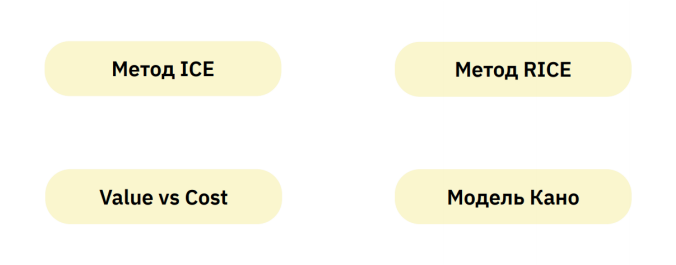  
рис 1.5.

Value vs Cost (ценность против трудозатрат). 

В этом методе используется два критерия для оценки идей. Ценность, которую фича или идея может принести, и трудозатраты, насколько сложно фичу будет реализовать. При этом важно детализировать, что именно является ценностью, и как именно считать трудозатраты. 

Ценность нужно измерять по тому, насколько быстро это фича или идея приведет вас к поставленной цели. 

Трудозатраты — более комплексный параметр в него входит время, необходимое для реализации, сложность реализации и количество людей, которые должны быть задействованы.

И так, определив шкалы от 1 до 10 по параметру “ценность” и по параметру “трудозатраты”, можно распределить все гипотезы по системе координат (рис 1.6). 

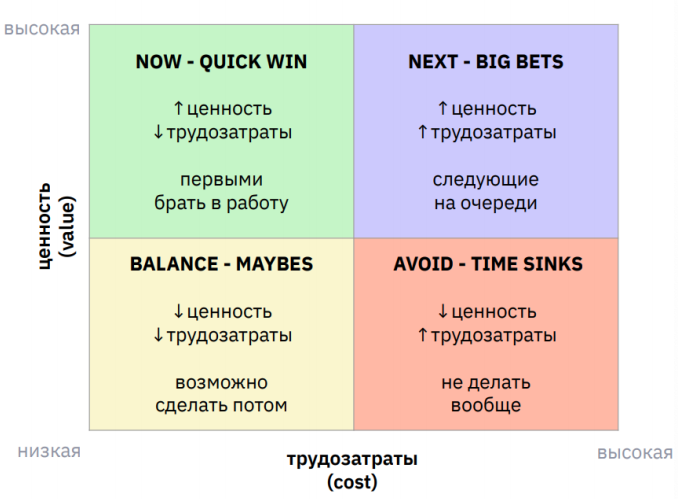  
рис 1.6.

В получившейся области моно выделить 4 квадрата:

1.	NOW или Quick win. В этот квадрат попадает то, что нужно делать в первую очередь. Это фичи, ценность которых очень высока, и при этом они делаются достаточно просто.

2.	BIG BETS или Next. Это фичи, которые, принесут большой эффект, но при этом они требуют довольно больших трудозатрат, временных, финансовых. Такие гипотезы нужно брать в работу следующими.

3.	MAYBES или Balance. Возможно, их нужно делать, а может быть, и не нужно.  Это гипотезы, которые не требуют больших вложений, но при этом и эффект от них не очень высокий. Поэтому здесь каждую гипотезу нужно рассматривать в отдельности, и принимать по ней решение. Если все-таки делать такие фичи, то они будут 3-им приоритетом.

4.	AVOID или Time Sinks. Это гипотезы, которые требуют очень больших вложений, очень больших трудозатрат, но при этом приносят очень малый эффект. Поэтому делать их нецелесообразно. Такие гипотезы нужно убирать из бэклога, но тем не менее, оставлять их в архиве. Возможно, позже ситуация на рынке изменится, и эти гипотезы станут актуальными. 

Метод ICE. 

        I * C * E = ICEscore

I (Impact) – влияние 

С (Confidence) – уверенность в правильности оценки остальных двух критериев

E (Easy) – легкость реализации
Это метод, который относится к скоринговым методам, то есть к методам, при котором ведется подсчет баллов для каждой гипотезы, и уже на основе этих финальных баллов расставляется приоритет. 

В критерии Confidence чем выше балл, тем наиболее вы уверены в своей оценке. В критерии Easy чем выше балл, тем легче выполнить эту фичу. Оценив гипотезы по этим 3 критериям по десятибалльной шкале, мы перемножаем баллы и получаем финальный балл, или ICEscore. Чем выше балл - тем выше приоритет.

Метод RICE.

    R * I * C / E = RICEscore

R (reach) – охват, скольких людей затронет обновление (тыс. юзеров)

I (Impact) – влияние (0,25 – 2)

С (Confidence) – уверенность в правильности оценки остальных двух критериев (%)
E (Еffort) – трудозатраты (человеко-мес.)
Чем выше RICEscore, тем приоритетнее будет данная гипотеза.

Модель Кано.

Модель предлагает оценить необходимость той или иной гипотезы самим пользователям. В основе модели Кано лежит предположение о том, что удовлетворенность пользователей зависит от тех функций, которые есть в продукте.

В данном случае критерии – это удовлетворенность и польза. Польза говорит о том, насколько эта конкретная фича закрывает конкретные задачи пользователя. А удовлетворенность – то, насколько ей комфортно пользоваться (рис 1.7).

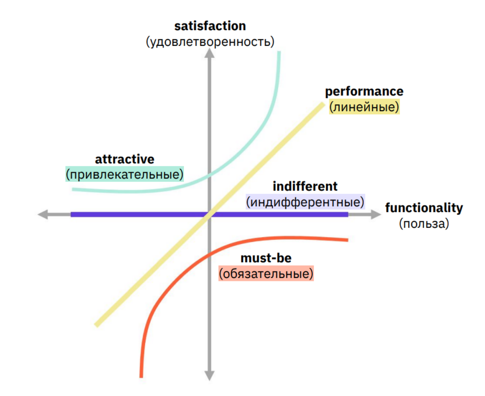  
рис 1.7.

На основе этих критериев можно разделить все гипотезы на четыре группы. 

Первая группа гипотез называется линейные, потому что график здесь линейный. Чем больше таких функций в продукте, тем наиболее удовлетворены пользователи. Это те функции, которые нужно делать в первую очередь.

Вторая группа – обязательные. Это красный график. Это функции, отсутствие которых вызывает жесткий негатив у пользователей, но присутствие которых не особо повышает удовлетворенность. Именно поэтому они обязательны.

Третья группа – привлекательные функции. Это такие функции, которые несут мало пользы, но очень хорошо влияют на удовлетворенность пользователей. Они в основном связаны с каким-то эмоциональным эффектом и хорошо отличают продукт от конкурентов.

Четвертая группа - индифферентные гипотезы. График индифферентных гипотез совпадает с осью пользы. Такие функции повышают функциональность продукта, но совершенно не влияют на удовлетворенность пользователей. Чаще всего это такие функции, которые позволяют хорошо работать приложению, например, ускоряют работу или позволяют обрабатывать большие объемы информации, но они не видны, и пользователь этого не замечает.

Проверка гипотез — это дорогостоящее мероприятие. Если разрабатывать все идеи, часть из которых неизбежно окажутся ошибочными, можно потерять очень много сил и времени. Чтобы избежать бессмысленных трат, всегда нужно искать дешевые методы валидации гипотез. 

Проверка через исследования всегда дешевле, чем полноценная разработка.  

**1.7 Как протестировать гипотезу решения**

Развитие продукта требует систематического и структурированного подхода для идентификации и проверки гипотез. Один из эффективных методов для тестирования гипотез продукта – это использование спринтов. Спринты предлагают команде возможность быстро прототипировать, проверять и выбрасывать ненужные идеи, обеспечивая более уверенные решения на основе данных и обратной связи от пользователей. 

Определение гипотезы продукта.

Перед началом спринта необходимо ясно определить гипотезу продукта. Гипотеза должна быть конкретной, измеримой и ориентированной на решение конкретной проблемы или достижение цели. 

Планирование спринта.

Планирование спринта включает определение целей и задач, которые должны быть выполнены в течение определенного временного периода. Команда должна определить, какие шаги и эксперименты необходимо провести для проверки гипотезы. Например, это может включать разработку прототипа функции, создание тестовой группы пользователей, определение метрик для оценки успеха и собственно проведение самого эксперимента.

Прототипирование и разработка.

В ходе спринта мы обычно создаем и тестируем прототип или «дешевый» MVP (минимально жизнеспособный продукт) для тестирования гипотезы. Прототип может быть простым интерфейсом, демонстрирующим основные функции или потенциальные изменения в продукте. Разработка в ходе спринта должна быть сфокусирована на том, чтобы создать минимально необходимый функционал для проверки гипотезы.

Тестирование с пользователями.

Одна из ключевых составляющих спринта – это тестирование продукта с реальными пользователями. Нужно выбрать группу пользователей, которые могут оценить и предоставить обратную связь по прототипу или MVP. Затем предоставить им доступ к продукту или провести пользовательские интервью, чтобы получить качественные данные об их впечатлениях, потребностях и проблемах, связанных с гипотезой продукта. Важно задавать открытые вопросы, чтобы получить полезные и подробные ответы.

Анализ данных и обратная связь.

Собранные данные и обратная связь от пользователей должны быть проанализированы и оценены в контексте гипотезы продукта. Нужно использовать метрики, определенные на этапе планирования спринта, чтобы измерить эффективность и успешность прототипа или MVP. 

Обратная связь пользователей может также помочь в определении дополнительных улучшений или изменений, которые могут повлиять на результаты.

Самый популярный тест, который позволяет сравнить метрики до и после – это А/В тест. А/В-тестирование, или split-тестирование, является методом сравнительного анализа двух или более вариантов (групп) продукта, функции или элемента пользовательского интерфейса. Оно позволяет оценить, какой из вариантов более эффективен, основываясь на данных и поведении пользователей.

Итерация и повторение.

На основе анализа данных и обратной связи команда должна принять решение о том, следует ли продолжать развивать и улучшать продукт на основе гипотезы или пересмотреть ее. Если результаты спринта подтверждают гипотезу и показывают положительные результаты, команда может перейти к следующей итерации разработки, добавив новые функции или улучшения. Если же результаты не соответствуют ожиданиям или гипотеза не подтверждается, команда должна пересмотреть стратегию и, при необходимости, сформулировать новую гипотезу.

Использование спринтов для тестирования гипотез продукта является эффективным инструментом, позволяющим быстро и систематически проверять итерации и идеи, снижая риски и улучшая результаты разработки. 

Однако, важно помнить, что спринты должны быть хорошо организованы, иметь четкие цели и задачи, а также включать активное взаимодействие с пользователями. Таким образом можно достичь лучших результатов и создать продукт, отвечающий потребностям и ожиданиям пользователей.

**Глава 2. Проведение исследований и обработка результатов**  

**2.1 Исследование проблемы низкой конверсии** 

В продукте уделяется большое внимание сбору данных о поведении пользователя, система сбора метрик в Amplitude была введена уже давно. На основе собранных данных можно сделать выводы о том, сколько пользователей доходит до приобретения подписки и каким путем. Рассмотрим данные за июнь 2023 года.

Абсолютная конверсия С1 составляет 0.25%. Разделим этот процесс на этапы.

Относительная конверсия из посетителя сайта в регистрацию личного кабинета составляет 6.2%. Это больше маркетинговый показатель, который указывает на то, является ли реклама в каналах понятной для посетителя, нравится ли сам сайт, и понял ли человек, как и зачем сюда попал.

Далее посетителю предлагается зарегистрировать бесплатный личный кабинет с пробным функционалом. Относительная конверсия из регистрации кабинета в оплату подписки на расширенный функционал составляет 4.33% (рис 2.1).
 
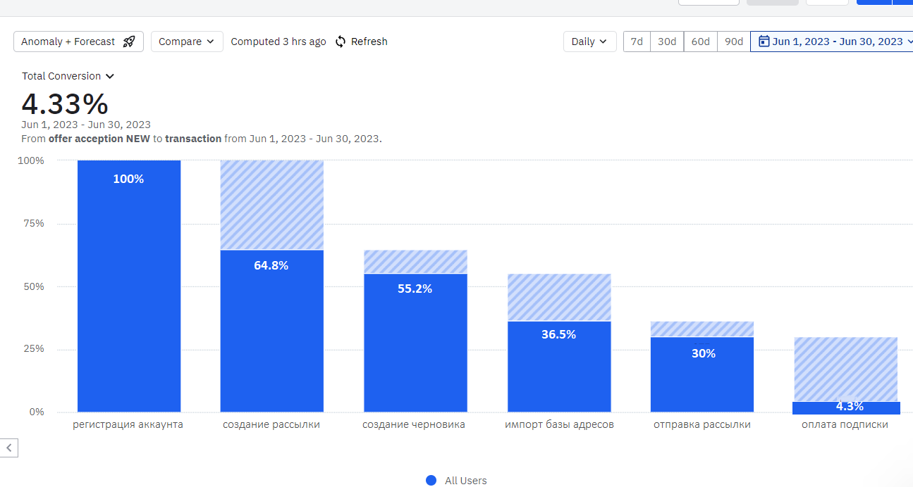
рис 2.1.

Разберемся, в чем тут дело.
После регистрации личного кабинета пользователю предлагается заполнить анкету, оставив некоторую информацию о компании, его роли в ней и задачах, которые он планирует решать через сервис. Это делается для того, чтобы собрать информацию о пользователе для статистики и предложить наилучшее решение на этапе продажи.

Затем пользователь попадает в web-интерфейс сервиса, где у него появляется возможность попробовать функционал на минималках с ограничением на количество данных. Первое, что он видит, это стартовая страница, на которой есть ссылки на базу знаний, краткое видео о возможностях и связь со службой поддержки (рис 2.2).
 
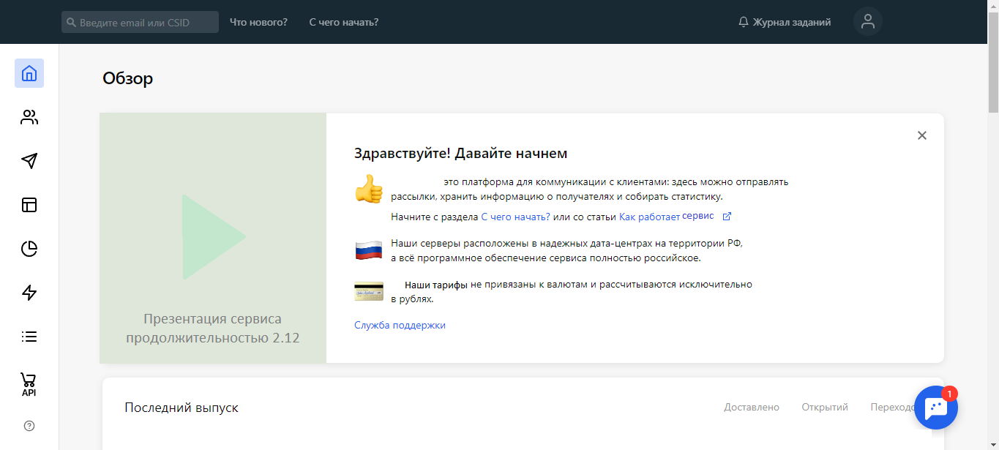
рис 2.2.

По этим ссылкам пользователь не переходит, а начинает изучать меню, и пробует выполнять действия, которые приведут его к целевому результату – отправке письма.

При этом порядок шагов у пользователей разный, каждый из них идет своим путем, рассмотрим наиболее популярный из них. 

1.	Создание рассылки. Это первое, что приходит в голову. Но найти нужный раздел не так просто. На этот шаг после попадания в интерфейс переходит 64.8% пользователей, что составляет его конверсию.

2.	Создание черновика. При настройке рассылки пользователь видит редактор шаблона письма. Конверсия в этот шаг составляет 85.2%.

3.	Импорт базы адресов. Когда черновик создан, пользователь пытается отправить рассылку, и на этом этапе понимает, что отправка доступна только на его собственный адрес, и ему нужно загрузить базу контактов. Конверсия в этот шаг составляет 66%.

4.	Отправка рассылки. Теперь рассылку можно отправить, но, чтобы это сделать, пользователю нужно вернуться в этот раздел. Конверсия в этот шаг – 82.4%.
После этого рассылка попадает на модерацию, которая может занимать до суток (если рассылка попала в нерабочее время).

5.	Покупка подписки. Это целевое действие для компании. Для пользователя этот шаг означает, что он выполнил свою цель: письмо отправлено, письмо доставлено, он видит отчет об этом и статистические данные. На этот шаг переходит лишь 14.4% пользователей.

Такая низкая конверсия означает, что за время знакомства пользователь не осознал ценности продукта или продукт не решает его задачи. 
Сформулируем гипотезы:

1.	Пользователю не нужен продукт, он попал в него случайно.

2.	Пользователю нужен продукт редко или разово, и ему достаточно функционала бесплатной версии.

3.	Пользователю нужен продукт, но функционал сервиса не решает его задачу.

4.	Пользователю нужен продукт, функционал сервиса решает задачу пользователя, но он не понял, как это сделать.

Чтобы проверить эти гипотезы, необходимо получить обратную связь от пользователей, которые не оплатили подписку.

С пользователями, попавшими в группу 1 или 2 мы ничего не сможем сделать, они не являются целевыми. Пользователи из группы 3 могут дать идеи для разработки нового функционала, но некоторые из них также могут быть нецелевыми, т.к. их задачи могут не соответствовать антиспам-политике сервиса (или требованиям законодательства, к примеру). Группа 4 для нас будет самой информативной, пообщавшись с этими людьми, мы поймем, на что следует обратить внимание при донесении ценности продукта до пользователя.

**2.2 Исследование нелояльной аудитории**

Чтобы узнать, почему пользователи уходят из сервиса, нужно провести качественное исследование, пообщаться с этими пользователями и расспросить их об опыте взаимодействия с продуктом. Из-за большого количества и низкой лояльности был выбран метод краткого телефонного интервью. 

На основании полученных ответов можно разделить их на следующие группы и проранжировать их по частоте ответа (табл 2.1)

| Ответ | Расшифровка | Доля | Влияние |
|----------|----------|----------|----------|
| Нет потребности (или не осознали ценность) | Например: 1. Больше не работают в компании 2. Компания решила не использовать этот канал 3. Прощупывание почвы в стартапе под потребность, которая возможно возникнет в будущем | 16,59% | Можем повлиять на уровне маркетинга |
| На паузе | Компания отложила все работы по e-mail маркетингу по независящим от сервиса причинам | 15,72% | Можем повлиять на уровне маркетинга |
| Неудобно | Не нравится интерфейс внутри платформы. Как правило, блочный редактор, либо общее впечатление из-за непонятности интерфейса | 14,41% | Можем повлиять на уровне продукта |
| Без объяснений | Не смогли объяснить, почему ушли. Не вспомнили причину, не захотели объяснять | 8,73% | Не можем повлиять |
| Выбирает | Находится в процессе выбора сервиса, пока не склоняется ни к одному | 6,99% | Можем повлиять на уровне маркетинга |
| Модерация | 1. Не прошли модерацию из-за того, что не соответствуют антиспам-политике сервиса. 2. Не поняли, что пройти её вообще-то можно, если написать в саппорт |	5,24% |	Можем повлиять на уровне продукта |
| Студент |	Не клиент. Просто использует сервис в рамках обучения в универе или школе |	5,24% |	Можем повлиять на уровне маркетинга |
| Нет тарифа | Слишком дорого, отсутствует удобный тариф |	4,80% |	Можем повлиять на уровне продукта |
| Оплачен |	Купили подписку по истечении временного окна и снятия статистики |	4,37% |	Не можем повлиять |
| Другой аккаунт |	Работа ведется на другом, уже оплаченном аккаунте. Этот аккаунт использовался для тестирования |	3,93% |	Не можем повлиять |
| Согласование |	Уже работают с сервисом, вот-вот интегрируются. Точно уверены | 3,49% |	Не можем повлиять |
| Маленькая база | База такая маленькая, что хватает бесплатного тарифа |	2,18% |	Можем повлиять на уровне маркетинга |
| Разовая задача | Нужно было решить одну маленькую задачу, для решения которой хватило бесплатного тарифа | 2,18% | Не можем повлиять |
| Нет базы | Базы контактов пока нет. Сервис изучался на будущее |	1,75% |	Можем повлиять на уровне маркетинга |
| Личная почта | Ушел, потому что в качестве отправителя разрешается использовать только корпоративный домен | 1,75% |	Можем повлиять на уровне продукта |
| Нет фичи | У платформы нет функционала, который нужен клиенту |	1,31% |	Можем повлиять на уровне продукта |
| Мало контактов в промо тарифе |	В бесплатном тарифе можно загрузить слишком мало контактов, поэтому задачу клиента нельзя решить, не заплатив |	0,87% |	Можем повлиять на уровне продукта |
| Медленное оформление | Не устроила длительность обработки заявки на подключение тарифа |	0,44% |	Можем повлиять на уровне продукта |
 
табл 2. 1

В таблице можно выделить ответы пользователей, которые подтверждают гипотезы 1 и 2 о том, что продукт не нужен, нужен был один раз или бесплатного функционала достаточно в промо тарифе. На этих пользователей мы не можем повлиять.

Гипотезу 3 подтвердили 1.31% опрошенных, что довольно мало в разрезе. Эти ответы можно сохранить в бэклог на будущее.

Гипотезу 4 подтвердили 14.41% респондентов, рассказав, что сервисом пользоваться неудобно. Некоторые из них поделились неудачным опытом взаимодействия. Рассказали про сервисы конкурентов, которые выбрали после тестирования.

Помимо этого, мы получаем интересные инсайты, на основании которых можем формировать стратегию развития продукта.

**2.3 Анализ функционала сервисов-конкурентов**

Больше всего опрошенных пользователей отметили, что продуктом пользоваться неудобно – 14.41%, некоторые столкнулись в сервисе долгой модерацией – 5.24%, еще некоторые – с отсутствием подходящего тарифа. Эти пользователи рассказали про продукты, которые выбрали после тестирования. Ранжируем их по частоте упоминания и исследуем по выбранным параметрам: изучим интерфейс, процесс знакомства с сервисом, тарифы и модерацию.
1.	Конкурент № 1. Сервис больше не доступен для новых пользователей из РФ, для уже зарегистрированных доступен, но без технической поддержки.

    Сервис собрал немного информации о пользователе после регистрации. Далее пользователь попадает на страницу с тарифами, где перечислены возможности и ограничения текущего бесплатного тарифа, а также предлагаются рекомендации по выбору платного тарифа и таблица сравнения. Тарифы отличаются размером адресной базы и наличием дополнительных возможностей.

    Далее на главной странице есть две большие кнопки «Создать рассылку» и «Создать адресную книгу», попробуем создать рассылку. Попадаем в цепочку действий, которые необходимы для этого. 

    На первом шаге выбираем или добавляем получателей рассылки и переходим к созданию черновика. В меню есть готовые шаблоны, возможность загрузки и конструктор. В конструкторе есть всплывающие подсказки по использованию. После создания шаблона предлагается заполнить информацию об отправителе. 
    
    Следующий шаг – настройка рассылки, здесь можно выбрать желаемую статистику рассылки, страницу отписки для пользователя, настроить автоматическое срабатывание по триггеру, а также сохранить рассылку в архив. Далее – предпросмотр и отправка, видим количество получателей, выбираем время отправки и видим, что рассылка ушла на модерацию. Также на электронную почту приходит письмо о модерации. Время модерации – 26 минут в выходной день. После выпуска рассылки также приходит письмо об успешно пройденной модерации на e-mail.

    После доставки писем видим понятную статистику открытий, переходов, отписок и ошибок доставки прямо на главной странице.
 
2.	Конкурент № 2. Российский многоканальный сервис рассылок.

    Письмо о регистрации приходит в спам на gmail. После регистрации пользователь попадает на страницу, где ему предстоит выбрать целевое действие – способ рассылки. И далее сценарий, по которому предлагается это сделать. 

    На первом шаге – выбор отправителя и темы, далее создание дизайна письма с большим выбором готовых шаблонов. Есть блочный редактор с большими возможностями. После создания письма предлагается выбрать или добавить получателей. Далее шаг отправки с предупреждением, что лучшая доставляемость достигается при использовании собственного домена. На шаге отправки можно сохранить письмо, как черновик. После отправки рассылка попадает на модерацию, модерация менее 1 минуты, скорее всего, автоматическая или отсутствует.

    Статистика после рассылки на главной странице довольно скудная, есть более развернутая в специальном разделе.

    Среди тарифов есть пакеты по размеру базы адресов, а также по количеству писем.

3.	Конкурент № 3. Еще один российский сервис для e-mail рассылок. 

    После регистрации пользователь попадает на страницу с советами по использованию сервиса и большой кнопкой «Создать рассылку». Рядом кнопка «Заказать быстрый старт» - помощь в освоении личного кабинета (услуга платная). 

    При нажатии на кнопку «Создать рассылку», открывается страница, где можно выбрать (не добавить) получателей, отправителя и тему, и перейти к созданию макета письма. В блочном редакторе довольно разнообразный функционал. После создания черновика его можно сразу отправить, и он уходит на модерацию. Информация о том, что письмо на модерации дублируется на электронную почту. Время модерации – около 3 часов. Об успешной или провальной модерации также приходит письмо на e-mail.

    Статистики по отправленной рассылке на главном экране нет. Статистику по открытиям и кликам видно в разделе «Рассылки», более подробная статистика разворачивается в специальном разделе.

    Среди тарифов есть пакеты по количеству контактов и по количеству писем. Дополнительные возможности в виде автоматизации платные.
 
4.	Конкурент № 4. Многоканальный сервис рассылок.

    После регистрации переходим на главную страницу c большими кнопками «Создать рассылку» и «Добавить получателей». В точности, как у Конкурента № 2. Далее весь функционал идентичен.

Выводы по итогам исследования.

По итогам изучения UX сервисов-конкурентов можно выделить интересные фичи, которые отсутствуют в нашем сервисе.

1.	Наличие на главном экране кнопки с указанием целевого действия (рис 2.3).

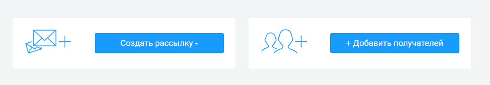
рис 2.3.

2.	Ведение пользователя к целевому действию по пути, с которого сложно свернуть и на который легко вернуться. (рис 2.4).

рис 2.4.

3.	Всплывающие подсказки по использованию сервиса (рис 2.5).

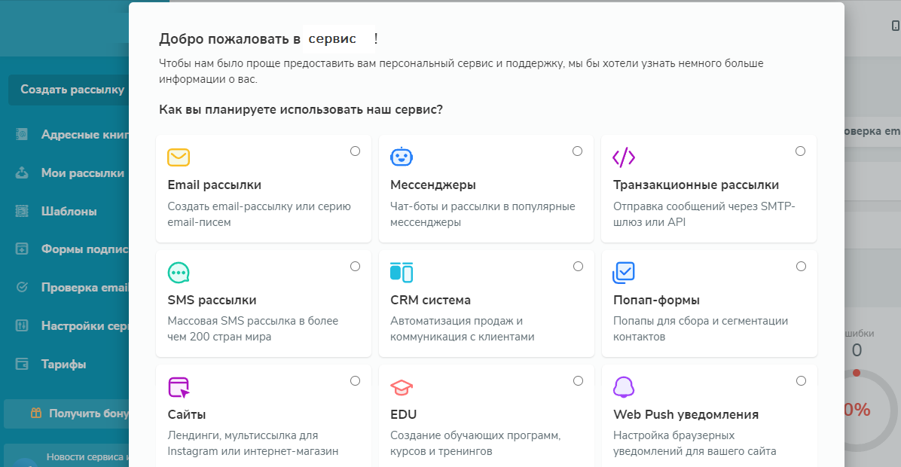
рис 2.5.

4.	Многофункциональный гибкий блочный редактор (рис 2.6).

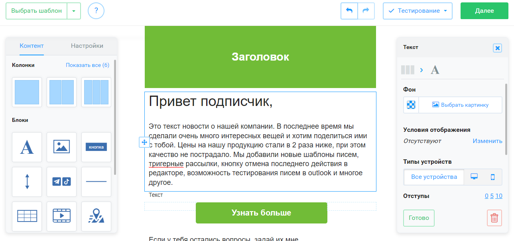
рис 2.6.

5.	Быстрая модерация менее 1 часа.

6.	Наличие тарифов по количеству писем.

7.	Наличие подписей к разделам.
Некоторые функции значительно упрощают работу с сервисом и на первый взгляд даже являются «must have» для подобных платформ. Эти инсайты можно использовать при формировании гипотез решения.

**2.4 Customer Jorney Map и User Jorney Map**

На основании данных, полученных из интервью с ушедшими пользователями, можно определить персону (юзера):

E-mail маркетолог SMB, мигрирующий из другого сервиса.

E-mail маркетологи в SMB – это люди, которые увеличивают продажи бизнесу за счет коммуникации с клиентами через e-mail рассылки. Они хотят удобный инструмент для автоматизации своей работы. Зачастую они ведут канал в одиночку. Ими могут быть в том числе руководители бизнесов.

Ключевые цели: растить прибыль компании через e-mail рассылки.

Проблемы: мой сервис рассылок заблокировали.

Задачи: дизайн писем, осуществление рассылок, рост метрик бизнеса.

Для этого клиента составим Customer Journey Map – карту пути клиента, добавив в нее путь пользователя при прохождении первой сессии (User Journey Map) (рис 2.7), (Приложение 1.).

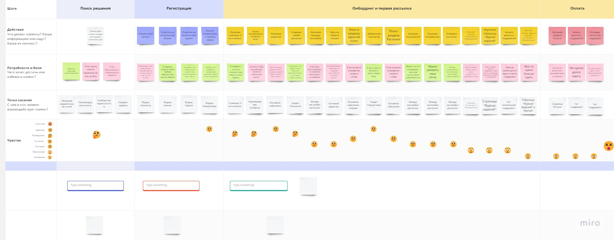
рис 2.7.

Проанализировав карту, видим какие места в интерфейсе вызывают негативные и смешанные эмоции. Это меню настройки рассылки, блочный редактор, основное меню, журнал заданий, раздел статистики, чат технической поддержки. Эти данные также необходимо использовать при формировании гипотез решения.

**2.5 Формирование гипотез решения на основании Job Story**

На основании данных, полученных в результате исследований, можно сформировать Job Stories о потребностях пользователя в сервисе: 

1.	Когда я ищу новый сервис для e-mail маркетинга, я хочу быстро перенести данные и настройки, чтобы не тратить много времени на переезд.

2.	Когда я настраиваю рассылку, я хочу убедиться, что все сделал правильно, чтобы не волноваться, что рассылка отправится.

3.	Когда я создаю дизайн письма в блочном редакторе, я хочу иметь много возможностей для редактирования, чтобы привлечь внимание получателя.

4.	Когда у меня есть готовая база контактов, я хочу быстро найти, где я могу загрузить ее, чтобы попробовать отправить им письмо.

5.	Когда я готов отправить письмо, я хочу быстро найти нужный раздел, чтобы не тратить свое время.

6.	Когда я отправил рассылку, я хочу понимать ее статус, чтобы убедиться, что она отправилась.

7.	Когда я отправил рассылку, я хочу сразу увидеть статистику по ней, чтобы планировать изменения.

8.	Когда я обращаюсь в техническую поддержку, я хочу быстро получить ответ о статусе моей рассылки, чтобы не волноваться о ее судьбе.

9.	Когда я решил купить подписку на сервис, я хочу быстро оформить все необходимые документы, чтобы скорее приступить к использованию.

Таким образом, учитывая JTBD концепцию можем сформулировать гипотезы по улучшению нашего продукта:

1.	Если сделать всплывающие подсказки по использованию продукта по шагам, это поможет пользователю находить нужные разделы и настройки и сократит время знакомства с сервисом, что может повысить конверсию в подписку на 10%.  

2.	Если перед отправкой письма сообщать пользователю обо всех непроизведенных обязательных и доступных настройках, это позволит показать неочевидную ценность продукта и может повысить конверсию в подписку на 2 %.

3.	Если мы добавим в блочный редактор дополнительный функционал, это поможет тем, кто не владеет html верстать красивые письма, что может повысить конверсию в подписку на 6 %.

4.	Если мы добавим уведомление пользователя о том, что рассылка ушла на модерацию, он быстрее среагирует, и до отправки не придется долго ждать, что может повысить конверсию в подписку на 2 %.

5.	Если мы реализуем показ статистики в реальном времени, это позволит пользователю быстрее увидеть результаты работы, что может повысить конверсию в подписку на 2 %.

6.	Если мы внесем изменения в работу модераторов, это ускорит отправку рассылок, что может повысить конверсию в подписку на 3%.

7.	Если мы автоматизируем формирование документов в личном кабинете, это снизит порог вхождения в оплату подписки, что может повысить конверсию на 3 %.

Данные о предполагаемой конверсии при этом берем из расчета, что все пользователи, для которых важна такая фича останутся в продукте. Фактические данные могут отличаться в меньшую сторону, так как в мире не все идеально. Но ввиду отсутствия опыта сейчас сложно предположить, как именно может повыситься конверсия. Эти идеальные данные можно учитывать на этапе приоритизации гипотез как показатель влияния на аудиторию. 

**2.6 Приоритизация гипотез**

Приоритизируя гипотезы, нужно руководствоваться в первую очередь здравым смыслом. Есть несколько методов приоритизации, и каждый из них основывается на определенном наборе данных. 

По результатам исследования мы можем определить ценность и трудозатраты. Приоритизировать на основе этих данных позволяет метод Value vs Cost и метод ICE. Наши изменения затронут всех пользователей, но мы имеем в виду повышение конверсии в покупку именно для новых клиентов, поэтому основываться на расчетах охвата аудитории не имеет смысла, метод RICE применять не целесообразно. Модель Кано основывается на мнении пользователей, в этом случае у нас недостаточно данных.
Приоритизация гипотез методом Value vs Cost (табл 2.2):

| Гипотеза | Value 1-min 10-max | Cost 1-min 10-max | Квадрат | Приоритет |
|----------|----------|----------|----------|----------|
| Если сделать всплывающие подсказки по использованию продукта по шагам, это поможет пользователю находить нужные разделы и настройки и сократит время знакомства с сервисом, что может повысить конверсию в подписку на 10%. |	10	| 9 |	BIG BETS |	1 | 
| Если мы добавим в блочный редактор дополнительный функционал, это поможет тем, кто не владеет html верстать красивые письма, что может повысить конверсию в подписку на 6 %. |	6 |	9 |	BIG BETS |	2 |
| Если мы добавим уведомление пользователя о том, что рассылка ушла на модерацию, он быстрее среагирует, и до отправки не придется долго ждать, что может повысить конверсию в подписку на 2 %. |	2 |	1 |	MAYBES |	3 |
| Если мы внесем изменения в работу модераторов, это ускорит отправку рассылок, что может повысить конверсию в подписку на 3%. |	3 |	4 |	MAYBES |	4 |
| Если перед отправкой письма сообщать пользователю обо всех непроизведенных обязательных и доступных настройках, это позволит показать неочевидную ценность продукта и может повысить конверсию в подписку на 2 %. |	2 |	5 |	MAYBES |	5 |
| Если мы автоматизируем формирование документов в личном кабинете, это снизит порог вхождения в оплату подписки, что может повысить конверсию на 3 %. |	3 |	6 |	TIME SINKS |	6 |
| Если мы реализуем показ статистики в реальном времени, это позволит пользователю быстрее увидеть результаты работы, что может повысить конверсию в подписку на 2 %. |	2 |	10 |	TIME SINKS |	7 |

табл 2.2

Приоритизация гипотез методом ICE (табл 2.3):

| Гипотеза | Impact 1-min 10-max |	Confidence 1-min 10-max |	Easy 1-min 10-max |	ISE score |	Приоритет |
|----------|----------|----------|----------|----------|----------|
| Если сделать всплывающие подсказки по использованию продукта по шагам, это поможет пользователю находить нужные разделы и настройки и сократит время знакомства с сервисом, что может повысить конверсию в подписку на 10%. |	10 |	9 |	2 |	180 |	1 |
| Если мы добавим уведомление пользователя о том, что рассылка ушла на модерацию, он быстрее среагирует, и до отправки не придется долго ждать, что может повысить конверсию в подписку на 2 %. |	2 |	6 |	9 |	108 |	2 |
| Если мы добавим в блочный редактор дополнительный функционал, это поможет тем, кто не владеет html верстать красивые письма, что может повысить конверсию в подписку на 6 %. |	6 |	8 |	2 |	96 |	3 |
| Если мы внесем изменения в работу модераторов, это ускорит отправку рассылок, что может повысить конверсию в подписку на 3%. |	3 |	5 |	6 |	90 |	4 |
| Если перед отправкой письма сообщать пользователю обо всех непроизведенных обязательных и доступных настройках, это позволит показать неочевидную ценность продукта и может повысить конверсию в подписку на 2 %. |	2 |	8 |	5 |	80 |	5 |
| Если мы автоматизируем формирование документов в личном кабинете, это снизит порог вхождения в оплату подписки, что может повысить конверсию на 3 %. |	3 |	4 |	4 |	48 |	6 |
| Если мы реализуем показ статистики в реальном времени, это позволит пользователю быстрее увидеть результаты работы, что может повысить конверсию в подписку на 2 %. |	2 |	4 |	1 |	8 |	7 |

табл 2.3

Первый приоритет получает гипотеза о всплывающих подсказках при знакомстве с сервисом. Она имеет высокую ценность, но и высокие трудозатраты. Уверенность в успехе тоже высока, так как многие конкуренты используют онбординг в своих сервисах.
Изменение блочного редактора – тоже приоритетная гипотеза. На ее реализацию потребуется много ресурсов, но и ценность достаточно высокая.

Уведомление пользователя о модерации несет маленькую ценность, но легко реализуемо. Эту гипотезу можно быстро протестировать, автоматизировав отправку письма о модерации при помощи функционала собственного сервиса.

Но интереснее всего для нас повысить конверсию более значительно, так что следующий шаг – продумать процесс знакомства пользователя с сервисом.

**2.7 Создание прототипа, иллюстрирующего решение**

Гипотеза: если сделать всплывающие подсказки по использованию продукта по шагам, это поможет пользователю находить нужные разделы и настройки и сократит время знакомства с сервисом, что может повысить конверсию в подписку на 10%.

Чтобы реализовать такие подсказки, нужно определить шаги, на которых пользователь сталкивается с препятствиями, предвосхитить вопросы, возникающие у пользователя и ответить на них. 

В этом поможет UJM. Видим, что у пользователя возникают сложности с настройки рассылки, основным меню в части поиска нужного раздела, определением статуса настройки и рассылки. 

Чтобы пользователю было проще ориентироваться в сервисе, когда он попадает в него впервые, нужно провести его по шагам по наиболее удобному пути. В этой ситуации можно дать пользователю на выбор несколько действий и далее вести его по одному из выбранных сценариев.

Принято решение разработать подсказки, которые будут сопровождать клиента от регистрации до целевого действия, подсветив при этом неочевидные функции сервиса. Пользователь должен иметь возможность как отказаться от подсказок на любом этапе, так и возобновить их получение. 

Выделив несколько основных путей, можно их визуализировать. Начать можно с чего-то максимально простого в виде набросков, черновиков и макетов. Основная задача на данном этапе – проверить логику, критично посмотреть на идеи, и их связность. Эти черновики нужно рисовать и редактировать до тех пор, пока не будет уверенности, что мы продумали все составные части нашего сценария. 

Нарисуем Wireframe – это образ дизайна низкой точности (рис 2.8). 

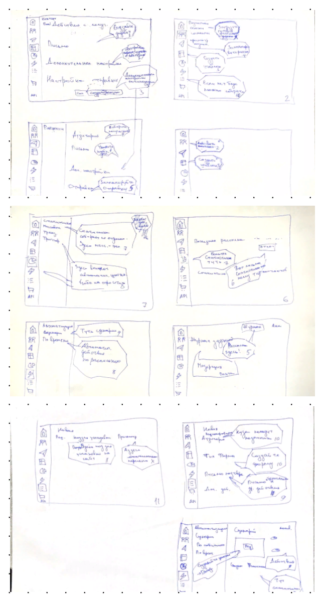
рис 2.8.

Он должен показывать основную группу контента, структуру информации, и базово визуализировать взаимодействия между интерфейсом и пользователем. Он необходим, чтобы проверить логику нашего продукта и простоту общения с ним.

Далее переносим ручные черновики в более удобную электронную форму, где проще их детализировать, в сервис, который позволяет более свободно рисовать, и передвигать элементы, например, Figma. В дальнейшем можно уточнять элементы контента, дизайна и составляющих частей продукта для последующей его большей детализации.

Сделаем в Figma Мокап – это графические наброски и элементы графического дизайна, который будет применен в нашем продукте на релизе (рис 2.9). 

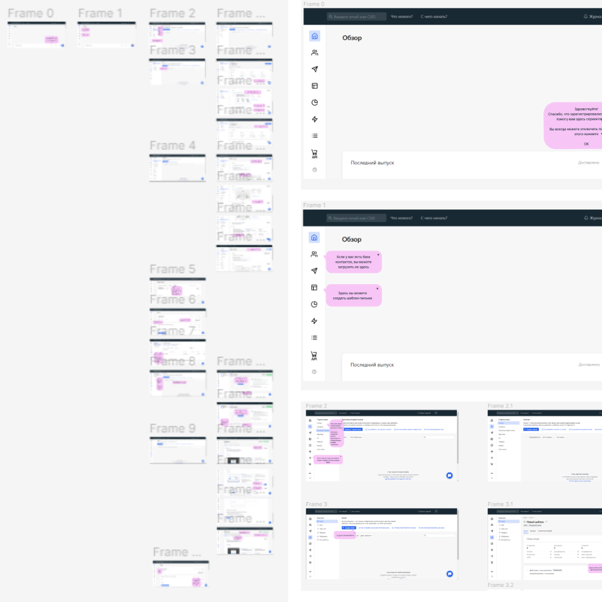
рис 2.9.

Во время взаимодействия с продуктом пользователь должен видеть статус работы системы, должен узнавать элементы, привычные ему. 

Сценарий должен обладать гибкостью и эффективностью использования. С одной стороны, у пользователя должна быть свобода действий, но при этом она должна быть контролируема нами.

Также необходимо придерживаться эстетики и минимализма в реализации подсказок. Нельзя забывать о стандартах единообразия того, что ожидают увидеть пользователь. 
Также мы должны помогать ему исправлять ошибки, которые он может допускать и реализовать профилактику этих ошибок, чтобы их было меньше.

[Ссылка на прототип](https://clck.ru/35UTf4"ссылка")

**2.8 Тестирование и обработка результатов**

Для тестирования гипотезы можно провести A/В-тест, выкатив подсказки в продакшн для части пользователей. Для этого подходит выборка 50/50, половина новых пользователей будут получать подсказки по использованию сервиса при знакомстве с ним.

Наблюдать за поведением когорты этих пользователей необходимо в течение временного окна, определенного на переход из регистрации в оплату, после чего можно сравнить показатели конверсии у групп A и B.

Помимо конверсии в покупку можно также оценить вовлеченность пользователей до и после внедрения фичи, то есть их реакцию на подсказки, время, через которое юзеры будут их отключать, количество просмотров подсказок. Это поможет оценить юзабилити такой фичи и поработать над недостатками.

Реализация фичи будет считаться успешной, если конверсия в покупку подписки в группе А будет хотя бы на 5% больше, чем в группе В.

Если желаемые показатели не будут достигнуты, следует собрать мнения пользователей из группы В, это поможет формировать новые гипотезы, принимать решения об изменении и доработке этой фичи или отказа от нее.

_Заключение_

Для того, чтобы продукт развивался и осваивал новые рынки, необходимо все время генерировать и проверять гипотезы.

Источником для идей становится изучение текущей ситуации, наблюдение за пользователями, более детальное их изучение, наблюдение за конкурентами. Все это этапы процесса Discovery.

Discovery — деятельность продуктовой команды, направленная на развитие и рост продукта. Это процесс работы над развитием продукта, который включает в себя анализ трендов и данных, изучение текущих и будущих клиентов, исследование технологии, анализ рынка и конкурентов, генерацию гипотез и проведение экспериментов. 

По сути, это процедура сбора информации, дающая понимание конечного потребителя, для которого разрабатывается продукт или его часть. Важно получить глубокое понимание ожиданий заказчика и лиц, принимающих решения с его стороны, а также конечных пользователей в отношении продукта. 

В процессе работы над проектом мы изучили текущую ситуацию в продукте, сформировали гипотезу проблемы, исследовали пользователей продукта, сервисы конкурентов, сформировали гипотезы решения, приоритизировали их и подготовили прототип для тестирования этой гипотезы.

В результате работы можно сделать выводы и выделить ключевые этапы проекта:

1.	В b2b-продуктах важно делать акцент на привлечении и удержании пользователей.

2.	Исследования конверсии из регистрации в покупку платного тарифа показали довольно низкий результат.

3.	Чтобы определить причину, потребовалось провести исследование пользователей, наблюдение за их поведением в продукте, опросы и глубинные интервью, а также исследование конкурентов.

4.	В результате исследований сформировались гипотезы решений, которые в последствии подверглись валидации и приоритизации.

5.	Для работы над проектом была выбрана гипотеза о том, что у пользователей существует проблема адаптации в новом сервисе.

6.	Решение этой проблемы может значительно повлиять на конверсию в подписку.

7.	Чтобы это проверить, был разработан прототип юзабилити-сессии для новых пользователей.

8.	Далее предлагается доработать прототип и внедрить на часть пользователей и сравнить конверсию после окончания тестирования.

9.	В случае провала гипотезы необходимо проводить дальнейшие исследования.

_Список используемой литературы_ 

1.	https://vc.ru/marketing

2.	https://neiros.ru/blog/marketing/proverka-gipotez-etapy-i-metodiki-testirovaniya-idey-v-biznese/ 

3.	https://vc.ru/design/545713-ux-analiz-konkurentov-insayt-podhodov-bsl 

4.	https://usabilitylab.ru/services/glossarij/konkurentnyij-analiz/ 

5.	https://journalovirus.ru/chto-takoe-user-journey-map-polnoe-rukovodstvo 

6.	https://www.uprock.ru/education/user-story-i-job-story-mapping

7.	https://netology.ru/blog/09-2022-job-stories

8.	https://habr.com/ru/hub/productpm

9.	Материалы из лекций и семинаров курса «Разработчик – Корпоративный продакт-менеджер»

_Приложения_

**Приложение 1. CJM**

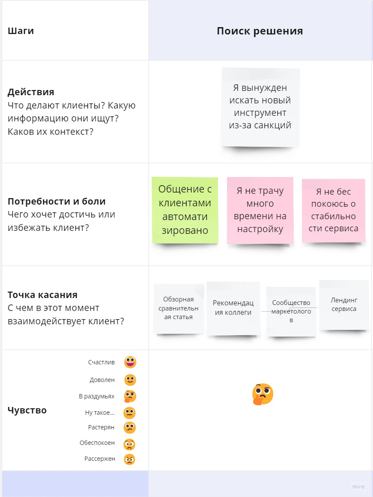

прил.1 стр.1

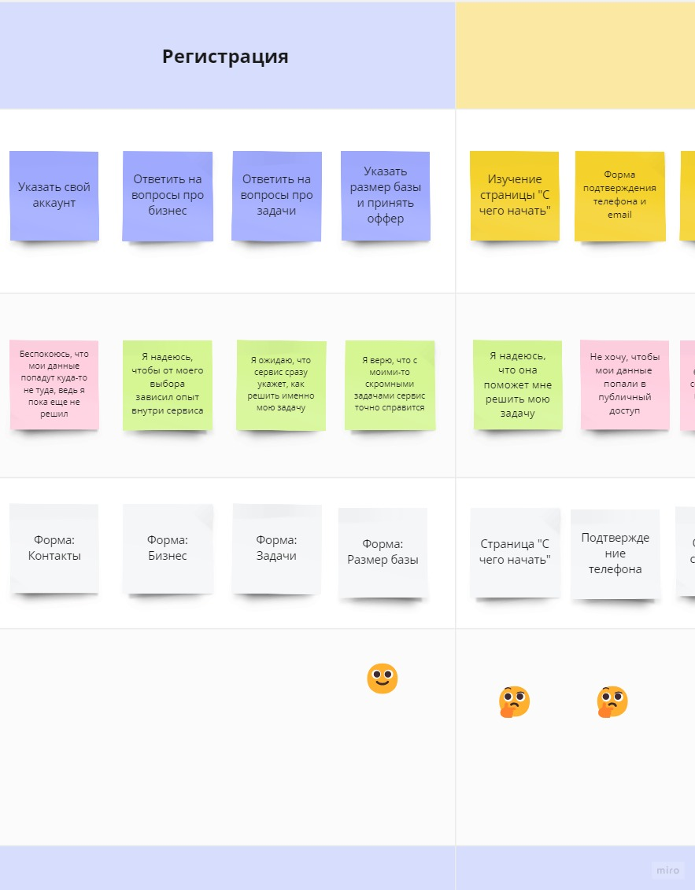

прил.1 стр.2

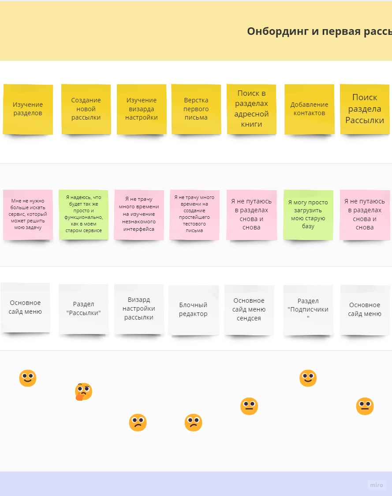

прил.1 стр.3

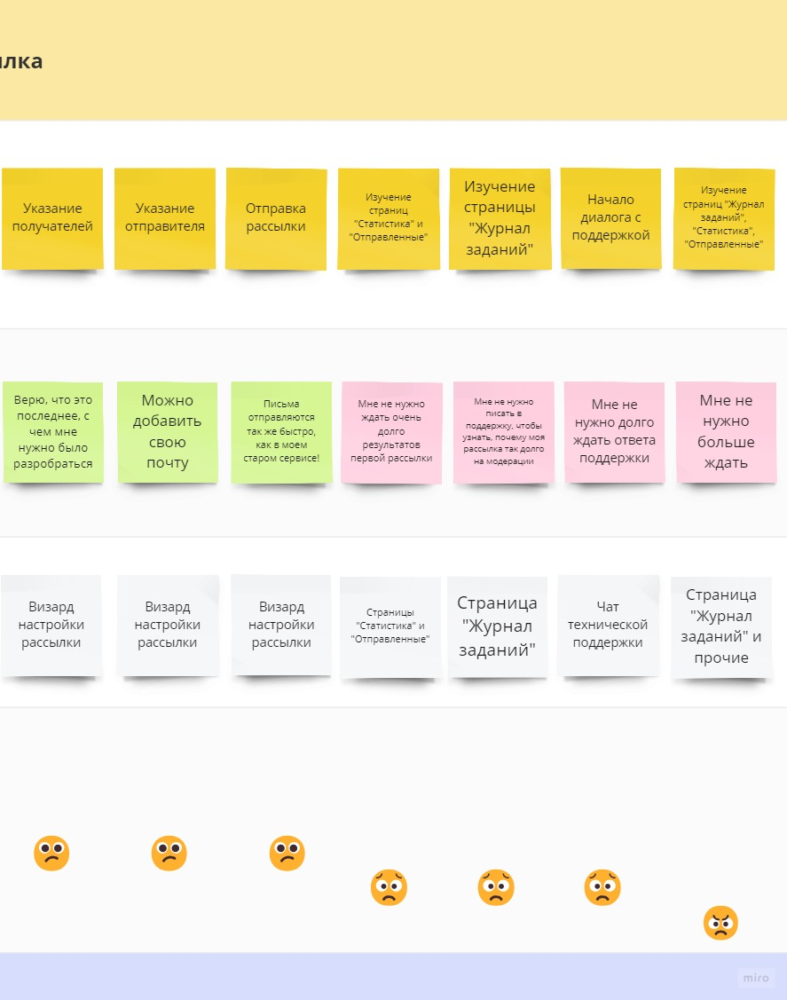

прил.1 стр.4

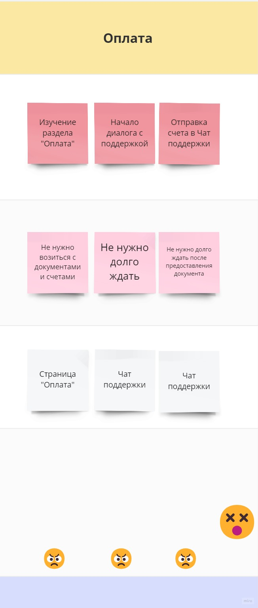

прил.1 стр.5

